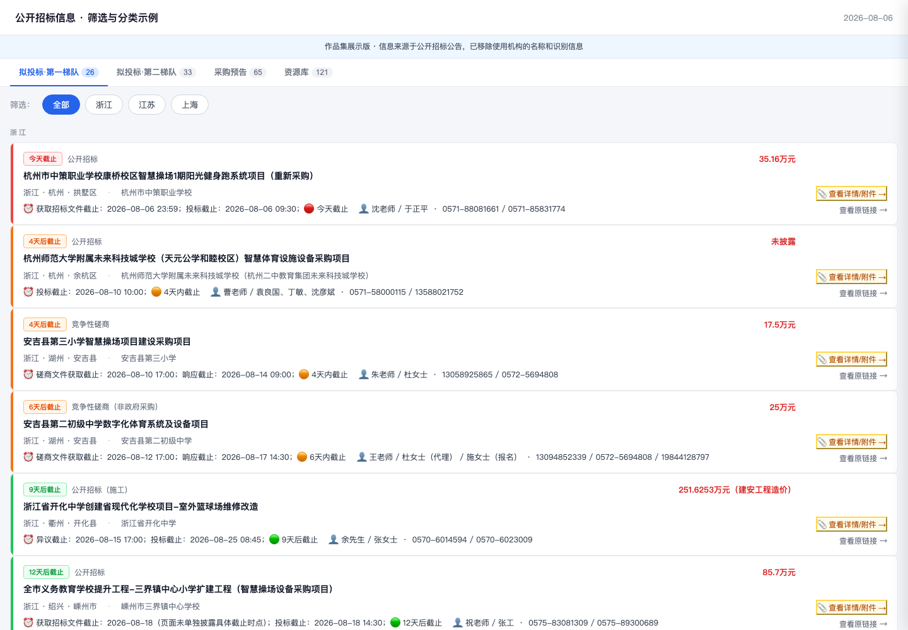

# 招标信息智能筛选工具

> 本仓库为项目脱敏展示版，不公开真实标讯、内部筛选标准、账号凭证或公司使用的完整自动化配置。

[在线查看一次真实工作流产出的脱敏简报](https://weisi-song.github.io/tender-intelligence-agent/) · [View the sanitized interactive brief](https://weisi-song.github.io/tender-intelligence-agent/)



下面的在线示例来自 2026 年 8 月 6 日的一次实际筛选结果。招标公告、采购单位和原文链接均来自公开信息；使用机构名称及相关识别信息已移除。

The interactive example is based on an actual filtering run from August 6, 2026. Tender notices, buyers, and source links are public; the identity of the organization using the workflow has been removed.

## 项目背景

公开招标是销售获取项目机会的重要来源。公司过去主要通过招标网站查询信息，最初由我每天人工搜索新标讯，再把可能相关的内容整理后同步给销售跟进。

实际做过一段时间后，我发现最耗时间的不是“搜不到”，而是搜到的结果太多。产品名称、应用场景和采购单位的表达方式并不统一，单一关键词会漏掉机会，多组关键词又会带来大量无关结果。

## 原来的工作方式

每天需要重复输入多组关键词，打开并阅读大量公告，再凭经验判断：是否与公司业务相关、价值有多高、是正式招标还是提前释放的采购意向、应该交给谁跟进。

还有一类信息不能只按直接成交概率判断。例如某些教育局发布的项目即使和当前产品关联不强，也可能成为销售建立联系的入口，因此仍值得保留。简单的关键词过滤无法表达这类业务判断。

## 我做的流程

- 用多组关键词批量抓取当天可能相关的标讯
- 让 AI 按业务规则进行第二轮阅读和筛选
- 将结果分为高优先级和次优先级，帮助销售决定查看顺序
- 区分正式招标信息和招标预告，匹配不同跟进节奏
- 对教育局等重要发布主体设置额外保留规则
- 提取项目名称、发布单位、时间、地区、阶段和相关性说明
- 将筛选结果整理成每日简报，交给销售进一步判断和跟进

## 系统如何运转

```text
招标网站
   ↓
多组关键词批量抓取
   ↓
AI 阅读公告 + 业务规则筛选
   ↓
相关性分级 + 招标阶段分类
   ↓
特殊保留规则检查
   ↓
生成每日招标简报 → 销售跟进
```

## 规则是怎么形成的

筛选规则不是我凭空写一版 Prompt 就结束了。早期我多次拿原始标讯请经理人工分类，标出高价值、一般相关、无关但需要保留、完全无关等情况；同时让 AI 按当时的规则处理同一批数据，再逐条比较差异。

每次误判都会反推规则：哪些词只是表面相关、哪些采购主体需要特殊处理、哪些公告虽然还没正式招标却值得提前跟进。通过多轮人工标注、AI 对照和规则迭代，结果才逐渐稳定到可以用于每天的常规工作。

## 我的角色

我主导完成了从人工任务到自动化流程的完整 0→1 建设，包括分析原有工作、确定关键词组合、设计筛选标准、编写和迭代 Prompt、搭建抓取与处理流程、设计分类方式、生成输出简报并持续校准。

经理提供业务判断和管理视角，并参与早期样本标注；我负责把这些经验转化为可重复执行的规则和系统。

## 带来的变化

团队不再需要每天从海量搜索结果中逐条筛选，销售收到的是已经按相关性和阶段整理过的候选机会。人工判断仍然保留在最终跟进环节，但重复阅读和初筛工作被大幅压缩，管理者的筛选经验也沉淀成了可以持续优化的规则。

## 公开范围

公开仓库呈现项目背景、筛选逻辑和迭代方法。后续将加入模拟标讯、分类结果和脱敏简报；真实数据源、内部规则与生产配置保持私有。

---

## English

# Tender Intelligence Agent

> This is a sanitized portfolio case study. Real notices, internal criteria, credentials, and production automation are not published.

## Context

Public tenders are an important source of sales opportunities. I was initially assigned to search a tender platform every day, identify potentially relevant notices, and forward them to sales.

The bottleneck was not lack of results but excessive noise. One keyword missed opportunities; multiple keywords produced a large set of superficially related notices that still required manual review.

## Previous workflow

Each day required repeated searches, opening and reading notices, judging business relevance, distinguishing active tenders from advance procurement notices, and deciding who should follow up.

Some records also mattered strategically rather than through immediate product fit—for example, education-bureau notices that could create a future relationship. Simple keyword filtering could not capture this judgment.

## What I built

- Batch retrieval across multiple keyword groups
- AI-assisted second-pass reading and filtering
- High- and secondary-priority classification
- Separation of active tenders and advance notices
- Special retention rules for strategically relevant issuers
- Structured extraction of project, issuer, date, region, stage, and relevance
- A daily brief for sales review and follow-up

## Workflow

```text
Tender platform → Multi-keyword retrieval → AI + business rules
                → Relevance and stage classification
                → Special retention checks → Daily brief → Sales follow-up
```

## How the rules evolved

The system did not come from a one-shot prompt. I repeatedly asked the manager to label raw notices as high value, generally relevant, unrelated but worth retaining, or irrelevant. I processed the same data with the current AI rules and compared the results item by item.

False positives and missed cases became new rules around misleading vocabulary, strategic issuers, and advance signals. Repeated human labeling, AI comparison, and prompt iteration made the workflow stable enough for routine use.

## My role

I led the full zero-to-one transition from a manual task to an automated workflow: analyzing the process, designing keyword sets and criteria, writing and iterating prompts, building retrieval and processing, defining classification, producing the brief, and calibrating results.

The manager contributed business judgment and early labels; I converted that expertise into repeatable rules and a working system.

## Outcome

Sales no longer had to read the full noisy result set each day. They received candidates already organized by relevance and stage. Human judgment remained at the final follow-up decision, while repetitive discovery and first-pass review were greatly reduced.

## Public scope

This repository documents the context, filtering logic, and iteration method. Synthetic notices, classifications, and a sanitized brief are planned. Real sources, rules, and production configuration remain private.
